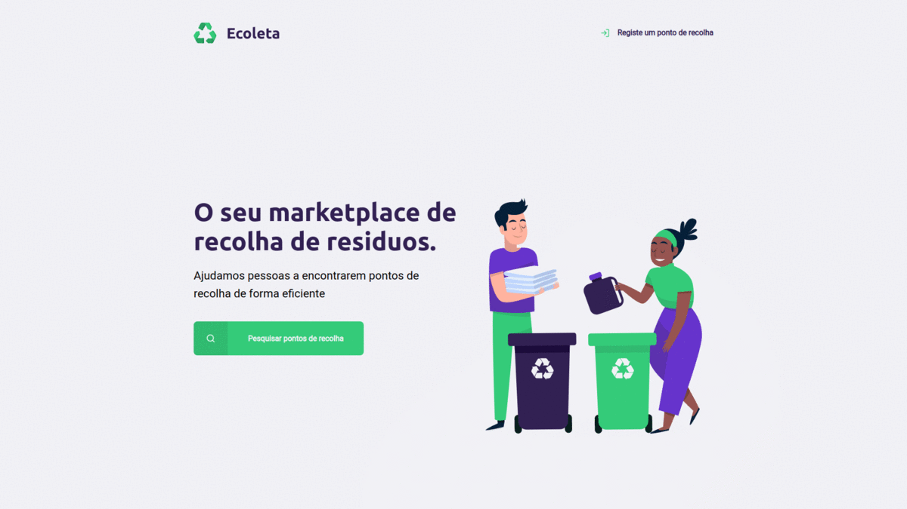

<h1 align="center">
    
</h1>

<h1>
    
</h1>

# Indice

- [Sobre](#-sobre)
- [Tecnologias Utilizadas](#-tecnologias-utilizadas)
- [Como baixar o projeto](#-como-baixar-o-projeto)

## 🔖&nbsp; Sobre

O projeto **Ecoleta**, é um e-commerce, que foi criado dentro do bootcamp **Next Level Week**, com o intuito de aprendermos e praticarmos novas tecnologias, do mundo da programação. </br>Todo o projeto foi realizado durante uma semana, com a mentoria da Rocketseat.

---

## 🚀 Tecnologias utilizadas

O projeto foi desenvolvido utilizando as seguintes tecnologias

- [HTML](https://developer.mozilla.org/pt-PT/docs/Web/HTML)
- [CSS](https://developer.mozilla.org/pt-PT/docs/Web/CSS)
- [JavaScript](https://developer.mozilla.org/pt-PT/docs/Web/JavaScript)
- [NodeJS](https://nodejs.org/en/)
- [Nunjucks](https://mozilla.github.io/nunjucks/)

---

## 🗂 Como baixar o projeto

```bash

    # Clonar o repositório
    $ git clone https://github.com/Xavi002/ecoleta-starter.git

    # Entrar no diretório
    $ cd ecoleta-starter

    # Instalar as dependências
    $ npm install

    # Iniciar o projeto
    $ npm run dev
```

---

Desenvolvido por Diogo Martins
